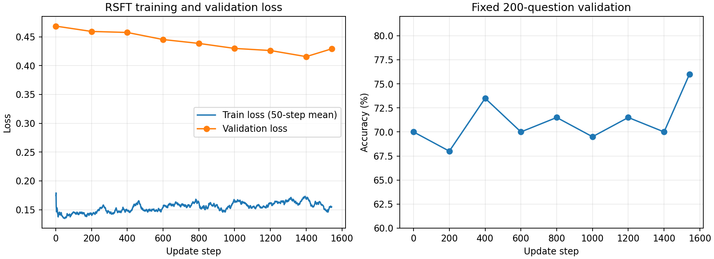

# 第一轮正式RSFT结果

2026-09-10约16:31启动，19:49:05完成，总耗时约3小时18分。全部采样、1542次更新、8次阶段验证及1319题完整测试成功结束，无OOM或异常。训练结束GPU释放；服务器未关机。自动跟进已暂停。

## 结果对比

| 指标 | 原SFT最佳模型 | 正式RSFT最佳模型 |
| --- | ---: | ---: |
| 测试正确数 | 878/1319 | 860/1319 |
| 测试正确率 | 66.57% | 65.20% |
| 测试标准解答loss | 0.4496 | 0.4256 |
| 格式通过率 | 99.92% | 99.92% |
| 解析率 | 99.77% | 99.70% |
| 本轮固定200题验证正确率 | 70% | 76% |
| 本轮固定200题验证loss | 0.4685 | 0.4290 |

最佳RSFT模型为第1542步，按预先规定的验证正确率优先、loss次优规则选出。它恰好也是最后一步。
完整测试净少答对18题，即下降1.3647个百分点。本次不能声称RSFT带来性能提升。
逐题核对：692题前后都对，273题前后都错，168题错变对，186题对变错。
测试ID、题目prompt与标准答案完全一致，1319个ID无重复。评估沿用同一生成设置与评分器。
每题只采样一次，变化包括生成随机性，不能将每道对变错都判定为能力遗忘；没有进行多seed重复实验或显著性检验。

## 筛选与完整性

- 6725训练题各4候选，共26900个；21764个合格，质量通过率80.91%。
- 每题最多保留2条后，最终12329条训练样本，最终保留率45.83%。
- 覆盖6393题（95.06%）；332题无合格回答。
- 5936题保留2条、457题保留1条，每题上限核对通过；仍存在2:1题目权重差异。
- 376道题保留的两个回答文本完全相同。当前规则没有去重，因此是允许的，但会降低回答多样性。
- 1542步无缺号重复号，累计处理12329样本，恰好1轮；训练与验证ID无交集。
- 张量峰值28.84GiB，缓存池预留峰值35.19GiB；micro-batch2，有效batch8，学习率5e-6。

## 如何理解曲线

训练loss约0.14–0.17，明显低于验证loss。训练内容是模型自己生成且经过筛选的回答，
本来就偏向模型熟悉和容易答对的内容；这个差距不能单独证明过拟合。
验证loss整体由0.4685降到0.4290，但自由生成正确率在68%–76%间波动。
标准解答概率提高不保证独立生成更正确。验证集用来选择多个checkpoint，最高验证分数也可能含有选模波动。

本轮相比小试验同时改变了题目规模、每题上限和采样后端（vLLM BF16），不能把差异仅归因于上限2条。

## 下一步建议（未启动）

1. 保留本次结果，暂不盲目增加epoch。先看changed_test_answers.json中的前后变化，作错误分析；不根据test逐题定制训练数据。
2. 对训练候选检查文本重复与推理质量。可在同题内先去重再最多选2条；但重复并未被证明是此次下降的原因。
3. 若比较筛选规则，复用已经保存的26900候选，只改一个因素；使用固定验证集和多seed生成估计稳定性，正式test用于最后报告。
4. 若目标是按课程继续学习，RSFT流程已完成，可以把本次“未提升”的结果与分析作为交付，接着学习DPO；不必为了阶段分数无限试验。

## 产物

本目录含完整chunks候选、selected.json、配置/划分、逐步日志、验证汇总、完整测试回答及指标。
changed_test_answers.json保存354道前后正确性变化的题目，audit_summary.json保存核对统计。
模型在服务器 /root/autodl-fs/posttrain/rsft-full-20260910/best_model，最终模型final_model与训练断点latest.pt亦保留。
没有新建Git提交、推送、关机或启动第二轮训练。
